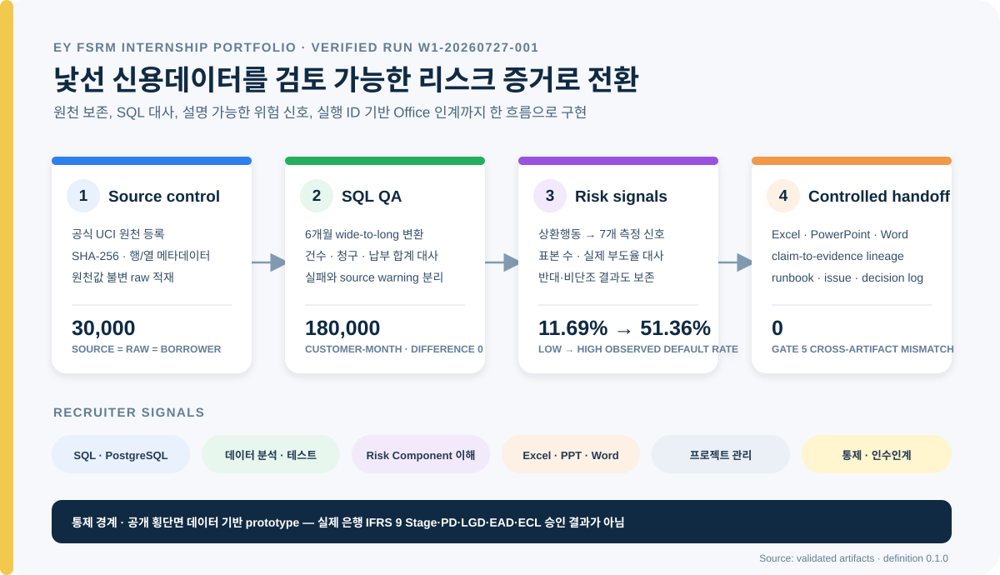

# Credit Risk Signal Lab

> IFRS 9 Risk Component 업무를 모사한 데이터·SQL·검증·인수인계 포트폴리오



## 채용 포트폴리오 발표자료

[`EY_FSRM1.pdf`](EY_FSRM1.pdf)는 EY한영 FSRM 리스크 컨설팅 인턴 지원을
위해 프로젝트의 문제의식, 데이터 분석, 신용위험 해석 및 업무 활용점을
정리한 **채용 포트폴리오용 발표자료**다.

## 1. 이 저장소가 해결하는 문제

은행 충당금 프로젝트에서 중요한 것은 모델을 한 번 만드는 것이 아니라, 다음 질문에 반복해서 답할 수 있는 구조를 만드는 것이다.

- 어떤 데이터와 정의로 숫자가 만들어졌는가?
- 숫자의 변화는 실제 위험 변화인가, 데이터 또는 산식 오류인가?
- 차주 행동과 거시 충격이 PD·LGD·EAD로 어떤 경로를 통해 전달되는가?
- 테스트에 실패했을 때 어떤 결과와 보고서가 영향을 받는가?
- 다른 담당자가 같은 결과를 재현하고 이어받을 수 있는가?

이 프로젝트는 공개 신용위험 데이터를 관계형 DB에 적재하고 SQL로 검증한 뒤, 경제적 전파경로·데이터 계보·결정 기록을 연결하는 Risk Harness를 구축한다.

## 2. 평가자에게 전달할 한 문장

> 경제적 전파경로를 데이터 정의와 SQL 검증 규칙으로 전환하고, 원천 데이터부터 최종 보고 수치까지 추적 가능한 형태로 문서화할 수 있다.

## 3. 30초 채용 검토표

| EY FSRM 역량 | 실제 산출물 | 검증 상태 |
|---|---|---|
| SQL·관계형 데이터 | [`sql/`](sql/) DDL, wide-to-long, 대사, DQ, 위험 신호 | 30,000 차주와 180,000 차주-월; 건수·청구·납부 대사 차이 0 |
| 데이터 분석·테스트 | [독립 Wave 1 검증](outputs/qa/validated/latest/wave1_independent_validation.json), [테스트 카탈로그](docs/validation/test_catalog.md) | 15개 enforced DQ pass, 0 fail, 3개 원천-domain warning 보존 |
| IFRS 9 Risk Component 이해 | [Wave 2 검증](outputs/qa/validated/wave2_attempt_02/wave2_validation.json), [scope 문서](docs/methodology/risk_component_scope.md) | PD 비교 수치는 독립 재현; 시간·민감도 근거 부재로 Gate 4 차단, Stage/EAD/LGD/ECL 미추정 |
| Excel·PowerPoint·Word | [XLSX](outputs/final/wave1_office_pack__W1-20260727-001.xlsx), [PPTX](outputs/final/wave1_office_pack__W1-20260727-001.pptx), [DOCX](outputs/final/wave1_office_pack__W1-20260727-001.docx) | 같은 실행에서 생성·재열기·값 대사; Gate 5 mismatch 0, unresolved 0/6 |
| PM 보조·인수인계 | [업무 상태](docs/governance/work_status.md), [결정 기록](docs/governance/decision_ledger.md), [Runbook](docs/wiki/runbook.md) | 역할·Gate·이슈·복구·다음 명령을 실행 ID 단위로 기록 |
| 데이터·리스크·AI 통제 | [lineage 계약](docs/data/lineage_spec.md), [지식 조회 계약](docs/wiki/knowledge_query.md) | 경제 가설과 데이터 계보 분리; 고정 6개 질문만 허용, 자유문 SQL/LLM 미사용 |

[`evidence_map.md`](docs/final/evidence_map.md)는 각 역량을 실제 파일과
검증 근거에 연결한다. Gate 5는 내부 일관성만 증명하며, 외부 게시
승인은 아직 사람의 판단을 기다린다.

## 4. 현재 구현 상태

| Wave | 핵심 산출물 | 중단해도 남는 증거 |
|---|---|---|
| Wave 0 | 목적, Harness, 역할, 게이트 | 문제를 통제 가능한 작업으로 설계 |
| Wave 1 | DB, SQL QA, 위험 신호 | 데이터 분석·테스트 업무 수행 가능 |
| Wave 2 | PD 회고 벤치마크·독립 검증 | 모형 수치와 승인 경계를 분리 |
| Wave 3 | 분리된 그래프·통제된 지식 조회 | 추적성과 인수인계 역량 |
| Wave 4 | Excel·PowerPoint·Word·Gate 5 | 반복 가능한 보고와 교차 산출물 통제 |

현재 실행 상태와 Gate 판정은 [`PROJECT_STATE.md`](PROJECT_STATE.md)가
정본이다. README의 내부 수치는 독립 검증을 통과한 실행만 반영하며,
외부 포트폴리오 주장은 Gate 5와 사람의 게시 승인을 추가로 요구한다.

## 5. 저장소 읽는 순서

### 사람이 먼저 볼 파일

1. `README.md` — 프로젝트 메시지와 실행 순서
2. `docs/charter/project_charter.md` — 문제·대상·주장·범위
3. `docs/final/evidence_map.md` — EY FSRM 업무와 산출물 연결
4. `docs/wiki/runbook.md` — 실행과 복구 방법

### 에이전트가 먼저 볼 파일

1. `AGENTS.md` 또는 `CLAUDE.md`
2. `HARNESS.md`
3. `PROJECT_STATE.md`
4. 현재 Wave의 `prompts/*.md`
5. 담당 역할의 `agents/*.md`

## 6. 아키텍처

```text
원천 파일
  → raw schema                [Hermes: 값 변경 금지]
  → staging/core schema       [Data Model: 명시적 변환]
  → SQL QA                    [Validator: 독립 검증]
  → risk signals              [경제적 경로를 관측 변수로 변환]
  → PD retrospective benchmark [시간 검증 부재로 Gate 4 차단]
  → data lineage + economic hypotheses [그래프 범위 분리]
  → issue/decision log
  → Excel/PPT/Word/README
  → governed knowledge query  [고정 질문·승인된 증거만]
```

## 7. 초기 데이터 전략

### Wave 1

- UCI `Default of Credit Card Clients`
- 원천 행·열 수와 해시는 [`source_registry.md`](docs/data/source_registry.md)의
  검사 근거로 관리
- 6개월 상환·청구·납부 이력을 borrower-month 구조로 변환
- wide-to-long 변환과 SQL 품질 테스트
- 행동 위험 신호와 다음 달 부도율 검증

### 후속 확장

- 회수·담보·월별 성과 데이터가 있는 대출 자료
- LGD·EAD·거시 시나리오
- 실제 은행 내부 기준이 아닌 공개데이터 기반 proxy로 명시

## 8. Wave 1 검증 결과

`W1-20260727-001`, 정의 버전 `0.1.0`에 대해 독립 Validation과
Gate 1–3가 통과했다. Excel·PowerPoint·Word 산출물도 같은 실행으로
대사되어 Gate 5가 `mismatch=0`, `unresolved claims=0/6`으로 통과했다.
이는 내부 일관성 증거이며 사람의 외부 게시 승인은 아직 `pending`이다.

| Reconciliation | Source | Derived | Difference |
|---|---:|---:|---:|
| source → raw rows | 30,000 | 30,000 | 0 |
| raw → borrower rows | 30,000 | 30,000 | 0 |
| expected → customer-month rows | 180,000 | 180,000 | 0 |
| bill total, NTD | 8,095,850,136 | 8,095,850,136 | 0 |
| payment total, NTD | 949,541,777 | 949,541,777 | 0 |

18개 DQ SQL 테스트 중 15개가 pass, 0개가 fail, 3개가 source-domain
warning이었다. 경고는 UCI 설명 밖의 education 345건, marriage 54건,
repayment status 120,334 customer-month건이며 원천값을 보정하거나
삭제하지 않았다.

| Signal comparison | Lower-risk/reference bucket | Higher-risk/comparison bucket |
|---|---|---|
| recent max delinquency | 0: n=21,560, default=12.52% | 2+: n=6,661, default=52.27% |
| delinquent months (6m) | 0: n=19,931, default=11.71% | 2+: n=5,643, default=52.84% |
| delinquency deterioration | <=0: n=24,569, default=18.17% | 2+: n=3,351, default=44.85% |
| latest utilization | <0.80: n=22,020, default=20.45% | >=1.00: n=2,123, default=30.05% |
| payment coverage | >=0.50: n=7,581, default=14.06% | <0.10: n=14,912, default=25.97% |
| zero-payment streak | 0: n=15,458, default=13.92% | 1: n=8,247, 33.37%; 2+: n=6,295, 27.53% |
| recent bill growth | <=0: n=13,347, default=25.83% | >=0.25: n=8,787, default=16.10% |

`zero_payment_streak`은 단조롭지 않았고 `recent_bill_growth`는 단순
가설의 예상 방향과 반대였다. 이를 제거하거나 threshold를 재조정하지
않고 한계로 남겼다.

| Initial risk band | Sample | Defaults | Observed default rate |
|---|---:|---:|---:|
| Low | 14,952 | 1,748 | 11.69% |
| Medium | 8,138 | 1,339 | 16.45% |
| High | 6,910 | 3,549 | 51.36% |

정본 검증 결과는
[`wave1_independent_validation.json`](outputs/qa/validated/latest/wave1_independent_validation.json),
보고 초안은
[`wave1_internal_report__W1-20260727-001.md`](outputs/final/wave1_internal_report__W1-20260727-001.md)에
있다. 동일 실행에서 생성된 검토 산출물은
[`Excel`](outputs/final/wave1_office_pack__W1-20260727-001.xlsx),
[`PowerPoint`](outputs/final/wave1_office_pack__W1-20260727-001.pptx),
[`Word`](outputs/final/wave1_office_pack__W1-20260727-001.docx)이며,
[`Office manifest`](outputs/final/wave1_office_manifest__W1-20260727-001.json)와
[`Gate 5 packet`](outputs/qa/validated/latest/gate_5.json)이 값과 실행
ID의 일치를 증명한다. LibreOffice를 사용할 수 없어 시각 렌더 검토는
`not_run`이고, OOXML 구조·재열기·값 대사는 완료됐다.

## 9. Wave 2–4 검증 경계

### Wave 2: 회고적 내부 PD 벤치마크

같은 6,000건 테스트 표본(관측 부도 1,332건)에서 독립 validator가
모집단, 예측, calibration, segment, 실행 ID와 정의 버전을 재계산했다.

| Model | ROC AUC | PR AUC | Brier score |
|---|---:|---:|---:|
| Static | 0.634600 | 0.320896 | 0.166000 |
| Behavioral | 0.740660 | 0.488144 | 0.144819 |
| Combined | 0.754496 | 0.494651 | 0.143825 |

이 수치는
[`Wave 2 validation attempt 2`](outputs/qa/validated/wave2_attempt_02/wave2_validation.json)가
독립 재현한 횡단면 회고적 내부 벤치마크다. borrower-level 관측
timestamp와 승인된 shock 값이 없어 Gate 4는 `blocked`이며, out-of-time
또는 외부 검증 결과가 아니다. Stage·EAD·LGD·ECL은 추정하지 않았다.

### Wave 3–4: 추적성과 통제된 보고

- [`data_lineage`](docs/data/lineage_spec.md)는 산출물에서 원천까지의
  dependency를 추적하고, `economic_transmission`은 검증 가능한 경제
  가설과 관측 방향을 별도 범위로 저장한다.
- [`governed knowledge query`](docs/wiki/knowledge_query.md)는 코드와
  manifest가 함께 고정한 6개 질문 ID만 받고, 경로·SQL·자유문 프롬프트를
  받지 않는다. 이는 semantic RAG나 LLM 구현 주장이 아니다.
- Office 산출물은 검증 JSON과 claim manifest에서 결정적으로 생성되며,
  Gate 5는 산출물 간 값·실행 ID·한계 문구를 독립 대사한다.

## 10. 빠른 시작

먼저 저장소 루트에서 구조와 원천 무결성을 확인한다.

```bash
python scripts/validate_scaffold.py
python src/ingestion/load_uci_credit_card.py --inspect-only
```

PostgreSQL 실행과 raw 적재는 다음 순서다. `.env`와 `DATABASE_URL`에는
로컬 자격증명만 사용하고 출력이나 커밋에 남기지 않는다.

```bash
cp -n .env.example .env
docker compose up -d postgres
python src/ingestion/load_uci_credit_card.py --run-id <NEW_INGESTION_RUN_ID>
```

각 실행에는 새 run ID를 사용한다. 원천 파일, 적재 로그, 검증 결과를
덮어쓰지 않는다. 전체 Wave 1 검증·보고 순서와 복구 방법은
[`runbook.md`](docs/wiki/runbook.md)에 있다.

독립 검증 결과가 생성된 뒤, 보고 가능 여부만 확인한다.

```bash
python -m src.reporting.build_wave1_report \
  --validation outputs/qa/validated/latest/wave1_independent_validation.json \
  --check-only
```

이 명령은 Gate 1–3가 모두 통과하지 않으면 실패한다. 통과하더라도
외부 게시 상태는 사람의 승인 전까지 `pending`이다.

현재 검증 입력으로 Office pack 적격성을 다시 확인하고 Gate 5를
재확인하려면 다음을 실행한다.

```bash
python -m src.reporting.build_wave1_office_pack --check-only
make gate5
```

새 실행의 Office 파일 생성과 독립 검증 명령은
[`runbook.md`](docs/wiki/runbook.md#7-gate-5-and-publication)에 있다. 생성기와
validator는 기존 산출물 또는 검증 증거를 덮어쓰지 않는다.

### Claude Code

```bash
cd credit-risk-signal-lab
claude
```

세션에서 다음 순서로 실행한다.

```text
/context
/wave0
/wave1
/status
/review
```

프로젝트의 Claude skill은 `.claude/skills/`에 있다.

### Codex

```bash
cd credit-risk-signal-lab
codex
```

그 뒤 `prompts/00_bootstrap_repository.md` 또는 현재 Wave 프롬프트를 붙여 넣는다. Codex는 루트 `AGENTS.md`를 저장소 작업 지도와 검증 규칙으로 사용한다.

## 11. 완료 정의

완료는 파일 생성이 아니라 다음을 의미한다.

- 원천과 파생 데이터의 건수·합계가 대사됨
- 테스트가 실행되고 실패가 기록됨
- 모든 최종 숫자가 SQL 또는 결정적 코드로 재생성됨
- 결과의 실행 ID와 정의 버전이 남음
- 한계와 proxy 범위가 명시됨
- 다른 사람이 Runbook만 읽고 재현 가능함

외부용 보고 완료에는 추가로 동일 run ID를 사용하는 보고서와
claim manifest의 Gate 5 대사 및 사람의 게시 승인이 필요하다.

## 12. 포트폴리오에서 강조하지 않을 것

- 단순한 멀티에이전트 기술 자랑
- 출처 없는 LLM 설명
- 실제 은행 IFRS 9 모형을 재현했다는 주장
- 검증되지 않은 숫자
- 복잡하지만 업무 의사결정과 연결되지 않는 기능
