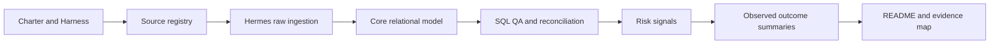
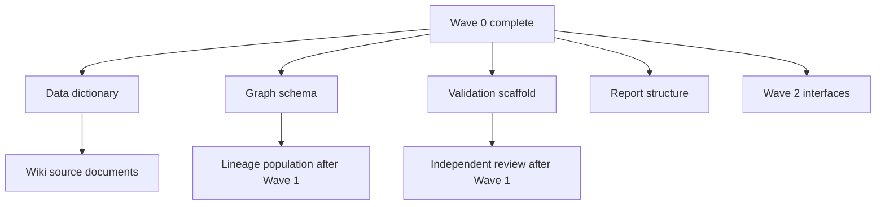

# Task Graph

## Critical path

## Parallel tracks

## Blocking conditions

- Core transformation is blocked until raw reconciliation passes.
- Risk-signal publication is blocked until core QA passes.
- Model publication is blocked until leakage and time validation pass.
- External numbers are blocked until cross-artifact reconciliation passes.
