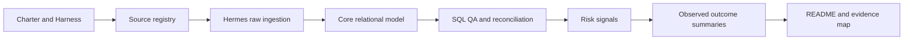
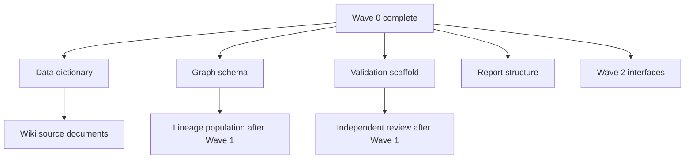

# Task Graph

## Critical path

## Parallel tracks

## Blocking conditions

- Core transformation is blocked until raw reconciliation passes.
- Risk-signal publication is blocked until core QA passes.
- Model publication is blocked until leakage and time validation pass.
- External numbers are blocked until cross-artifact reconciliation passes.

## File ownership

The Orchestrator assigns one writer per path for a task. Reviewers are read-only;
cross-owned changes are returned to the path owner instead of edited in place.

| Owner | Write paths | Review dependencies |
|---|---|---|
| Orchestrator | `PROJECT_STATE.md`, `docs/governance/{task_graph,decision_ledger,issue_log,work_status}.md` | all role packets |
| Hermes | `data/raw/`, `src/ingestion/`, `sql/ingestion/`, `logs/ingestion/`, `config/data_sources.yml`, `docs/data/source_registry.md`, source-ingestion audit rows | Data Model consumes reconciled raw only |
| Data Model | `sql/ddl/` except `030_meta_graph.sql`, `sql/staging/`, `docs/data/{logical_data_model,data_dictionary}.md` | Hermes reconciliation |
| SQL QA | `sql/quality/`, `sql/business_rules/`, `sql/reconciliation/`, `tests/data_quality/`, `docs/validation/{test_catalog,reconciliation_plan}.md` | Data Model definitions |
| Risk Signal | `sql/features/`, `src/features/`, `docs/methodology/{signal_dictionary,transmission_paths}.md` | Gate 2 evidence |
| Risk Component | `sql/risk_components/`, `src/models/`, `config/scenarios.yml`, `docs/methodology/risk_component_scope.md` | Gate 3 evidence |
| Graph | `sql/ddl/030_meta_graph.sql`, graph sections of `docs/data/lineage_spec.md`, `tests/graph/` | approved types; validated runs for result links |
| Validation | `src/validation/`, `tests/integration/`, `tests/regression/`, `docs/validation/model_validation_plan.md`, `outputs/qa/` | builder output; does not edit builder paths |
| Documentation | `README.md`, `docs/wiki/`, `docs/final/`, `presentation/`, report-generation code under `src/reporting/` | validated run outputs only |
| Reviewer | no builder path; issue reports only | all evidence, read-only |

Shared `audit` tables are defined by Data Model and synchronized with
`docs/governance/issue_log.md` by the Orchestrator interface. The Graph owner
defines `meta` tables. Each role may insert only its own run/test/lineage records
through approved interfaces.
